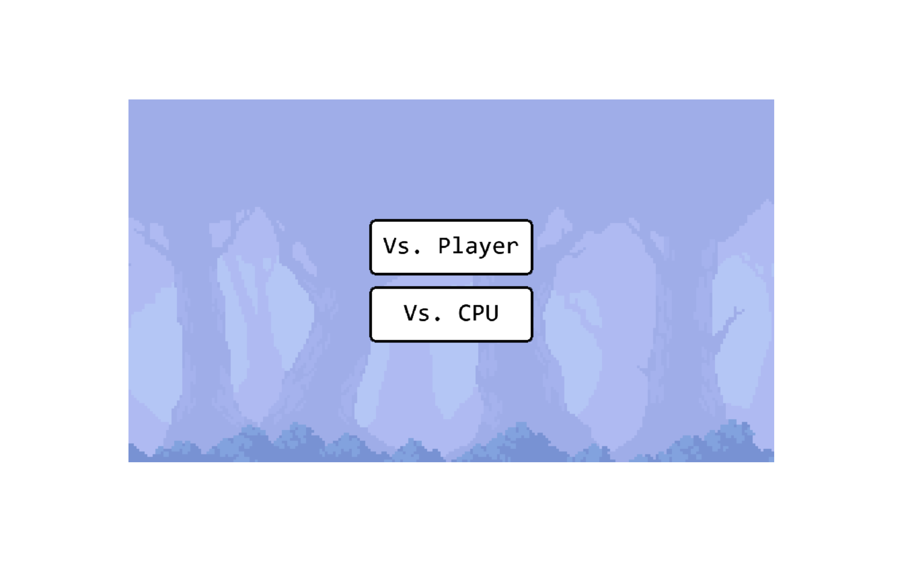
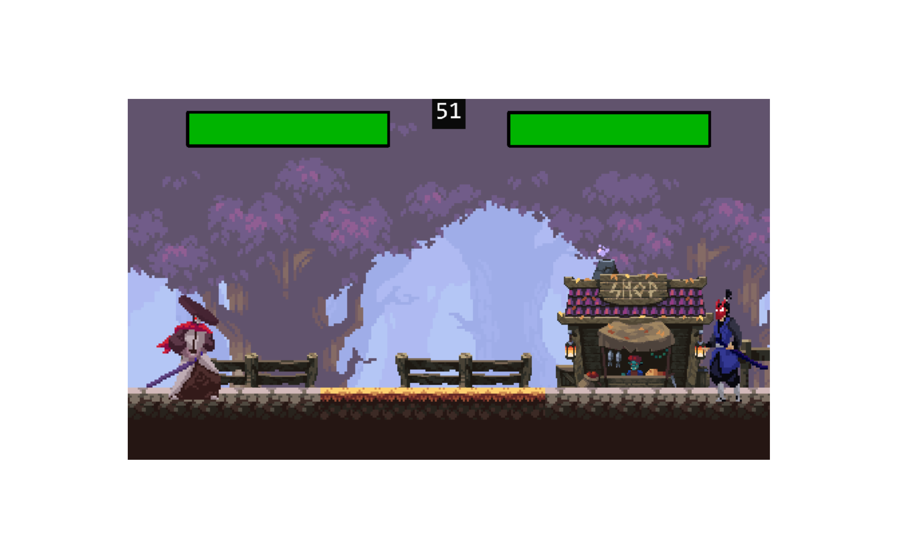

# Fighting Game | Kaboom.js

<p align="center">
  
  
</p>

## Technologies
- [Kaboom.js](https://kaboomjs.com/)
- [Vite](https://vitejs.dev/)
- [TypeScript](https://www.typescriptlang.org/)

## Inspired By

This project was inspired by a fantastic YouTube channel, **JSLegendDev**, which provided invaluable insights and served as the foundation for the development of this game. A special thanks to **JSLegendDev** for their excellent tutorial on **JavaScript Fighting Game Development Tutorial with Kaboom.js** that guided me throughout the creation process.

[Link to the Inspirational Video](https://www.youtube.com/watch?v=TLH0taCeE6I&ab_channel=JSLegendDev)

## Installation

1. Make sure you have Node.js and npm (Node Package Manager) installed on your system.
2. Clone this repository to your local machine or download and extract the ZIP file.
3. Open a terminal window and navigate to the project's root directory.
4. Run the following command to install the project dependencies:

```bash
npm install
```

## Usage

1. After installing the dependencies, you can start the development server using the following command:

```bash
npm run dev
```

2. This will launch the game in your default web browser. You can now enjoy playing Fighting Game!

## Contributing

Contributions are welcome! If you find a bug, have a feature request, or want to contribute in any other way, please open an issue or submit a pull request on the project's GitHub repository.

## License

This project is licensed under the [MIT License](MIT_LICENSE.txt).

---

Feel free to customize this README.md according to your project's specifics. Good luck and have fun building and playing Fighting Game! 🎮✨
